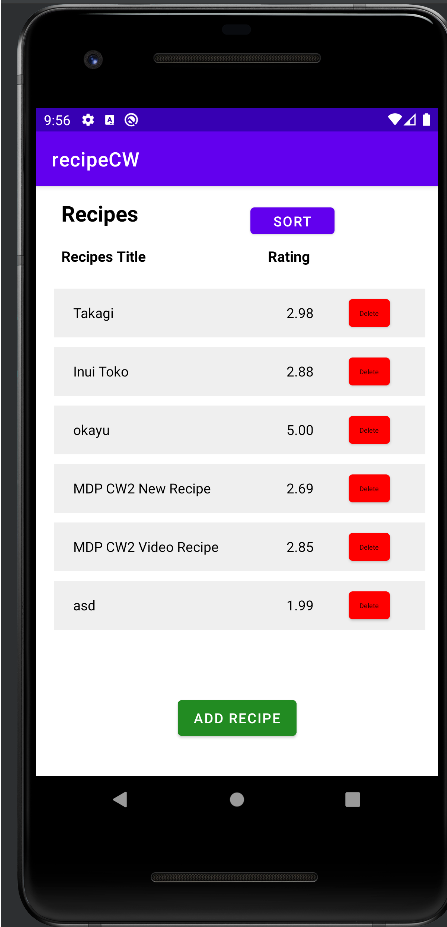
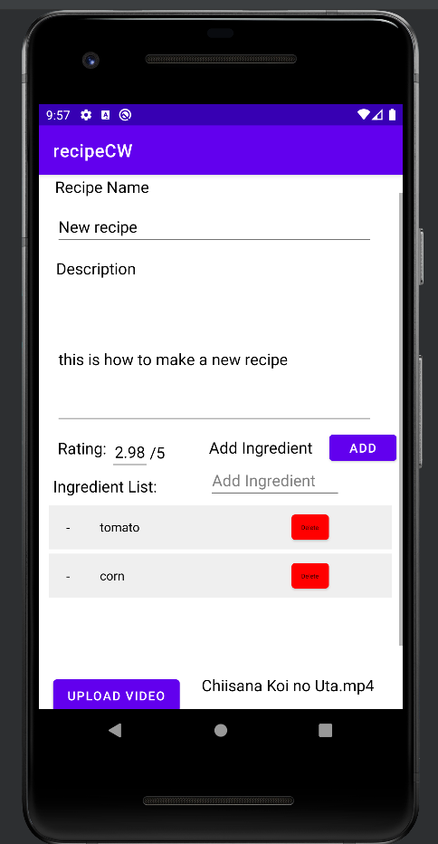
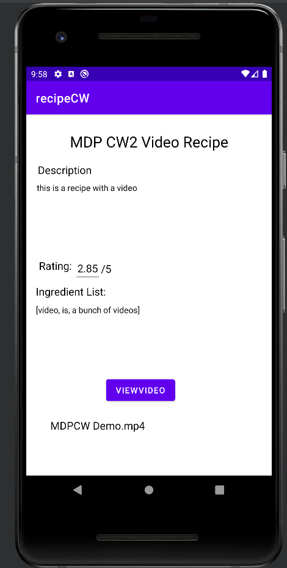
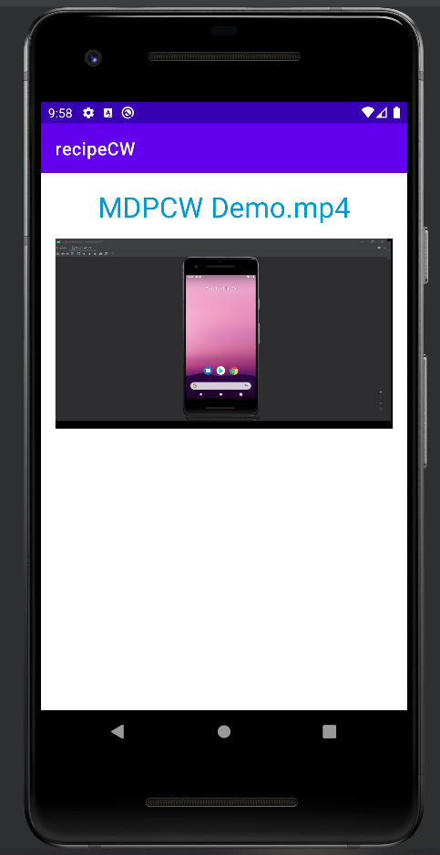

# Made by Kevin Ferdinand 20125628 for MDP CW2 2022
## Tested in VM : Pixel 2 API 29 Android ver 10
## Tested in Physical Machine : Samsung A52S with API 31 Android ver 12

This is a recipe app for Coursework about saving recipes

Refenreces:
Most of the functions in CW1
https://www.javatpoint.com/java-sqlite
https://stackoverflow.com/questions/27003486/printing-all-rows-of-a-sqlite-database-in-android
https://www.geeksforgeeks.org/how-to-delete-data-in-sqlite-database-in-android/
https://stackoverflow.com/questions/7510219/deleting-row-in-sqlite-in-android
https://findnerd.com/list/view/How-to-select-video-from-gallery-in-Android/6704/
https://www.youtube.com/watch?v=aQAIMY-HzL8&ab_channel=CodingWithMitch
https://beginnersbook.com/2013/12/java-arraylist-of-object-sort-example-comparable-and-comparator/
https://stackoverflow.com/questions/5357455/limit-decimal-places-in-android-edittext
https://www.geeksforgeeks.org/how-to-view-and-locate-sqlite-database-in-android-studio/
https://developer.android.com/reference/android/text/InputFilter
